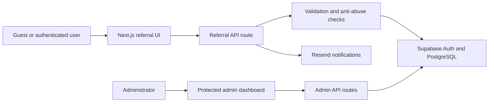

# Verisure Referrals

An end-to-end referral intake and tracking workflow designed for Verisure Peru. The application centralizes the process from referral submission to commercial follow-up, with automated validation, notifications, authentication, and an administrative dashboard.

> This project demonstrates workflow automation rather than an LLM-based AI agent: it coordinates identity, validation, persistence, notifications, and role-based operations in a single flow.

## What problem does it solve?

Referral information can become fragmented when it is collected and followed up manually. This project provides one workflow where:

1. A guest or authenticated user submits a referral.
2. The server normalizes and validates the submitted data and consent.
3. Anti-abuse and duplicate checks run before the record is created.
4. Supabase stores the referral with an initial status.
5. Resend sends transactional notifications to the referred person and the internal team when configured.
6. Authenticated users can track their referrals, while administrators can manage the complete pipeline.

## Main features

### Referral experience

- Referral submission for guests and authenticated users.
- Peruvian mobile-number validation and optional referred-person email.
- Explicit consent validation.
- Duplicate detection by email and phone number.
- Five-minute submission cooldown per referrer.
- Association of previously submitted guest referrals after sign-in.
- Referral status tracking: `registered`, `contacted`, `quoted`, and `contracted`.

### Authentication and authorization

- Supabase Auth with PKCE-based sessions.
- Password recovery and authentication callback flows.
- Bearer-token verification in protected API routes.
- Role-based administrator access through the `profiles` table.

### Administrative workflow

- Search and status filters.
- Server-side pagination.
- Referral status updates with optimistic UI and rollback on failure.
- CSV export for operational follow-up.
- Referrer profile enrichment for the administrative view.

### Automated notifications

- Confirmation email to the referred person when an email is provided.
- Internal notification containing the new referral details.
- Email failures do not roll back a successfully saved referral.
- HTML escaping for user-provided values included in email templates.

## Architecture



The browser uses the Supabase anonymous key for client authentication. Operations that require elevated database access run only inside server-side route handlers using the service-role key.

## Tech stack

| Area | Technology |
| --- | --- |
| Framework | Next.js 16 with App Router |
| UI | React 19, Tailwind CSS 4, Lucide React |
| Language | TypeScript 5 |
| Authentication | Supabase Auth |
| Database | Supabase PostgreSQL |
| Email | Resend |
| Quality | ESLint 9 |

## Project structure

```text
app/
├── admin/                         # Admin authentication and dashboard
├── api/
│   ├── admin/referrals/           # Protected list and status endpoints
│   └── referrals/create/          # Validation, persistence, and email workflow
├── auth/callback/                 # Supabase authentication callback
├── referidos/                     # Authenticated referral tracking
└── page.tsx                       # Public landing and referral entry point
components/                        # Shared UI components
lib/                               # Supabase clients and shared utilities
public/                            # Static assets
```

## Local setup

### Prerequisites

- Node.js 20 or newer.
- A Supabase project.
- A Resend account if email notifications are required.

### 1. Clone and install

```bash
git clone https://github.com/DavidB26/referidos-verisure.git
cd referidos-verisure
npm install
```

### 2. Configure environment variables

Create a `.env.local` file in the project root:

```env
NEXT_PUBLIC_SUPABASE_URL=your_supabase_project_url
NEXT_PUBLIC_SUPABASE_ANON_KEY=your_supabase_anon_key
SUPABASE_SERVICE_ROLE_KEY=your_supabase_service_role_key

RESEND_API_KEY=your_resend_api_key
EMAIL_FROM=verified-sender@your-domain.com
EMAIL_INTERNAL_TO=internal-team@your-domain.com
```

`EMAIL_INTERNAL_TO` is optional. Keep `SUPABASE_SERVICE_ROLE_KEY` server-side and never expose it through a `NEXT_PUBLIC_` variable.

In Supabase Auth, add the application's `/auth/callback` URL to the allowed redirect URLs.

### 3. Configure Supabase

The application expects these tables:

- `profiles`: user ID, full name, DNI, Verisure-customer flag, and role.
- `referrals`: referrer identity, referred-person contact information, consent, status, notes, and timestamps.

Configure database constraints and Row Level Security policies before using the application with real data. Schema migrations are not currently included in this repository and are listed as a future improvement.

### 4. Run the application

```bash
npm run dev
```

Open [http://localhost:3000](http://localhost:3000). The administrator sign-in is available at [http://localhost:3000/admin/login](http://localhost:3000/admin/login).

## Available scripts

```bash
npm run dev      # Start the development server
npm run build    # Create a production build
npm run start    # Start the production server
npm run lint     # Run ESLint
```

## Security decisions

- Protected API endpoints validate the Supabase access token on the server.
- Administrator endpoints verify the user's role independently of the UI.
- Referral validation and duplicate checks run server-side.
- The API handles PostgreSQL uniqueness violations without exposing database details.
- User-provided email content is escaped before being inserted into HTML templates.
- Secrets are read from environment variables and are not committed to the repository.

## What I would improve next

1. Move email delivery to a background queue with retries and failure tracking.
2. Add versioned database migrations and seed data for reproducible environments.
3. Record an audit trail for referral status changes.
4. Add unit, integration, and end-to-end tests with a continuous-integration workflow.
5. Add structured application monitoring for API failures, authentication errors, and notification delivery.
6. Strengthen rate limiting with IP- and identity-aware controls.

## Author

Built by [David Beslanga](https://github.com/DavidB26).
